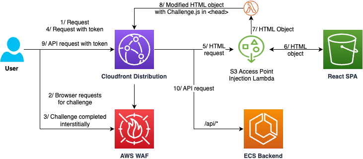

# AWS WAF Challenge SDK Injection Sample for Single Page Apps (SPA) and Static Content
This project demonstrates how to automatically inject the AWS WAF Challenge SDK (JavaScript) snippet into HTML pages served out of Amazon S3 by using an S3 Access Point Lambda. It is demonstrated as a simple todo frontend/backend web application. An AWS WAF web ACL will require all GET requests for HTML content to complete a Challenge interstitially (during page load) in order to avoid `fetch` requests early in page load failing due to a challenge response. The web ACL also includes the AWS Bot Control for Targeted Bot Control managed rule set in order to protect the backend APIs. The high level architecture of this project is illustrated below:



> [!IMPORTANT]
> This project is not expected to be deployed directly to a production environment. We recommend that you review the code and re-use only the relevant components for your existing frontend application.

This project is organized under the following directories:
1. `backend`: A backend Express.js API application that allows users to register, sign in, and add items to their todo list. Passport.js is used to manage identity and sessions. The demonstration deploys this as a Docker container to an AWS ECS Fargate cluster. API calls to `/api` are proxied through Amazon CloudFront.
2. `frontend`: A React 18 application that presents a frontend for users to register, sign in, and add items to their todo list by calling the backend application. The application is based on the [Create React App](https://create-react-app.dev/) framework. The demonstration deploys this to an Amazon S3 bucket proxied through CloudFront.
3. `infra`: An AWS CDK project to deploy AWS resources for this demonstration; an S3 bucket for the frontend, and ECS cluster for the backend, all served by a CloudFront Distribution with an web ACL. Requests to the S3 bucket are sent via an S3 Access Point, through which a Lambda function runs to inject the AWS WAF Challenge JavaScript automatically into the head element of all HTML pages.

We now walk through the steps to set up this demonstration in your account.

## Prerequisites
1. Docker: to build the backend and frontend applications
2. CDK bootstrapped in the us-east-1 region

## Deploying the Infrastructure Stack
This application is deployed to us-east-1 by using the following commands:
```
git clone https://github.com/aws-samples/injection-sample-for-aws-waf-sdk
cd injection-sample-for-aws-waf-sdk/infra
npm install
cdk deploy
```

The output `WAFSDKInjectionSampleStack.WAFSDKInjectionSampleEndpoint` presents the CloudFront URL that serves the demonstration frontend. Notice the initial interstitial challenge completion, and subsequent SDK integration on the frontend.

## Understanding the Demonstration

### Amazon CloudFront Configuration
CloudFront has two origins: the S3 bucket via an S3 Access Point, and an Application Load Balancer (ALB) fronting the ECS backend. The CloudFront distribution has a web ACL attached which is described below. 

### AWS WAF Configuration
The web ACL has two rules:
1. **Force Interstitial:** This rule intercepts all GET requests for HTML content (`Accept: text/html`) and enforces a Challenge action. This means a slight delay during the initial page load as the challenge is handled interstitially (perceptible to the user as a rapid redirect before landing on the application) - subsequent challenges will be handled invisibly by the Challenge JavaScript SDK running in the React application. We include this rule to avoid a situation where a `fetch` request in the web application during page load fails due to the Challenge JavaScript SDK not yet completing the token acquisition process. If your web applications do not make a fetch during initial page load (or have a retry mechanism) then you can consider leaving this out of your web ACL.
2. **AWS Bot Control for Targeted Bots:** This rule is required in order to get a JavaScript SDK URL that can be used in the frontend application. We switch the default `CAPTCHA` action to `CHALLENGE` for three of the targeted bot control rules (TGT_VolumetricSession, TGT_SignalAutomatedBrowser, TGT_SignalBrowserInconsistency) as we do not integrate with the AWS WAF CAPTCHA JavaScript API and would like to avoid situations where API calls fail due to CAPTCHA actions not being handled by the frontend application. We still recommend that you integrate with the CAPTCHA JavaScript API, and you can find a demo [here](https://github.com/aws-samples/aws-waf-captcha-react-demo). The rule set is scoped down to `/api` endpoints.

### AWS S3 Access Point with AWS Lambda Interceptor 
The Lambda Interceptor (found under `infra/waf-sdk-injection-lambda/inject.py`) is invoked for every object request to the S3 bucket with the React frontend application. Only HTML content is modified, and occurs through the insertion of the JavaScript SDK URL as a `script` tag in the `head` tag for the page. This process will add several hundred milliseconds latency to object request times however the resulting object is cached for 24 hours once loaded. Consider using CloudFront Origin Shield, and a higher TTL to further improve performance (albeit relying on invalidations in the case where objects are updated in S3).